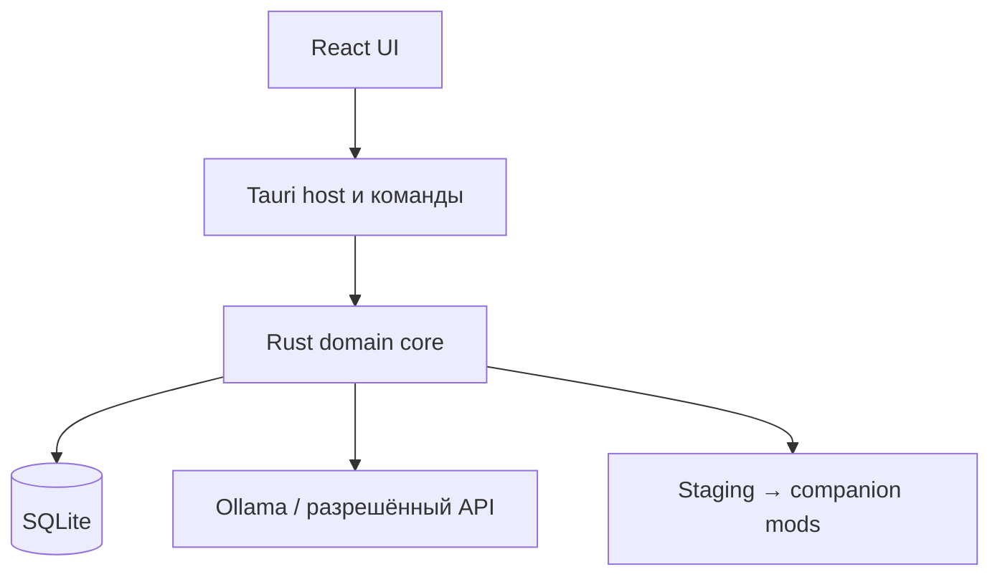

# Архитектура

## Архитектурный стиль

Продукт строится как **модульный монолит**: одно desktop-приложение Tauri, один Rust-процесс, одна локальная SQLite-база. React отвечает только за интерфейс. Доменное ядро не зависит от UI и вызывается также из внутреннего CLI для тестов и диагностики.

Отдельный Python runtime, локальный HTTP-сервер, Redis, Celery и микросервисы не нужны. Граница модулей обеспечивается Rust crates и типизированными интерфейсами, а не сетевыми протоколами.



## Модули

| Модуль | Ответственность | Чего не делает |
|---|---|---|
| `app-shell` | окна, dialogs, разрешения, lifecycle, системные пути, события UI | не переводит и не разбирает локализацию |
| `workspace` | обнаружение установок и модов, canonical paths, version profile, source snapshots | не пишет в исходные каталоги |
| `stellaris-loc` | byte-level чтение, lossless CST, typed markup, точечный render | не вызывает модель |
| `context` | ссылки из scripts, соседние строки, тип сущности, speaker/event chain, context signature | не изменяет script-файлы |
| `translation` | выбор терминов, memory retrieval, provider adapters, draft/review/repair | не получает права записи в файловую систему |
| `quality` | структурные, семантические, терминологические и языковые findings | не исправляет структуру без повторной проверки |
| `storage` | SQLite repositories, SQL migrations, jobs, provenance, last-known-good | не хранит секреты в открытом виде |
| `publisher` | staging, полная валидация, descriptor/profile, atomic publish, rollback | не публикует частичный результат |

Зависимости направлены внутрь: UI и провайдеры зависят от доменных контрактов, но parser и validator не знают о React, Ollama или конкретном облаке.

## Безопасный конвейер

1. **Discover.** Пользовательский выбор превращается в явный manifest. Все пути canonicalize; symlink и выход за разрешённые корни отклоняются.
2. **Snapshot.** Для каждого исходного файла фиксируются относительный путь, размер, кодировка и криптографический хэш. Каталог источника открывается только на чтение.
3. **Parse.** Локализация разбирается в concrete syntax tree, сохраняющий BOM, переводы строк, пробелы, комментарии, порядок, дубли ключей, суффикс версии и исходные escapes.
4. **Atomize.** Внутри значения строится typed markup tree. Переменные, scripted localisation, icons, format spans и escapes становятся непрозрачными атомами. Неизвестная конструкция получает finding и не передаётся как редактируемый текст.
5. **Contextualize.** Из выбранного мода и его зависимостей собирается минимальный контекст: тип объекта, связанные ключи, соседние реплики, speaker, triggers/effects только как данные и релевантные термины.
6. **Plan.** Diff engine классифицирует единицы как unchanged, new, changed, moved, deleted, context-changed или blocked. Unchanged не вызывает модель.
7. **Translate.** Модель получает JSON-схему с человеческими сегментами и идентификаторами атомов. Текст мода всегда помечен как недоверенные данные, не как инструкция. У модели нет инструментов и доступа к файлам.
8. **Review.** Независимый проход проверяет смысл и русский язык. Повторная попытка получает конкретные findings; это не слепой retry того же prompt.
9. **Render.** Только разрешённые текстовые spans заменяются в копии CST. Заголовок и путь формируются по version profile.
10. **Validate.** Проверяются round-trip invariants, ключи, occurrences, atoms, числа, encoding, coverage, семантика и output containment. Затем повторно сверяются исходные хэши.
11. **Publish.** Полный компаньон собирается во временном каталоге на том же файловом томе, затем атомарно переключается. Предыдущая версия остаётся last-known-good.

## Формальная модель единицы

Минимальная идентичность перевода не равна тексту строки.

```text
unit_id = hash(mod_stable_id, relative_path, localisation_key, occurrence_index)
source_revision = hash(raw_source_value, parser_profile_version)
context_signature = hash(entity_type, references, neighbours, dependency_profile)
```

Запись перевода содержит исходную ревизию, контекстную сигнатуру, версию официального корпуса и глоссария, provider/model, версии prompt и validators, статус review и ручное происхождение. Перенос перевода между разными контекстами разрешён только как кандидат и повторно проверяется.

## Данные и состояние

SQLite хранит:

- установки игры и version profiles;
- исходные моды, зависимости и snapshots;
- документы, units, occurrences, contexts и findings;
- глоссарий с формами, доменом и provenance;
- translation memory и manual overrides;
- persistent jobs, attempts, checkpoints и usage;
- опубликованные artifacts и last-known-good.

Пользовательские моды и полные тексты не попадают в Git. Сырые тексты не пишутся в обычные логи. Экспорт диагностического пакета требует явного действия и показывает состав до сохранения.

## Публикация компаньона

Для каждого источника поддерживается один app-managed companion mod. Он содержит только русскую локализацию, descriptor/dependency metadata и manifest происхождения; логика исходного мода не копируется. Существующая авторская русская локализация не дублируется по умолчанию. Удалённые исходные ключи удаляются из следующего артефакта, а ручные решения остаются в истории для возможного восстановления.

Конкретные descriptor-поля, каталоги launcher и правила load order принадлежат version profile. Они должны быть подтверждены на реальной установке в M1, а не зашиты по памяти.

## Границы доверия

- исходный мод, его строки, имена файлов и descriptor считаются недоверенными;
- canonical path обязан оставаться внутри выбранного source root или app-managed output root;
- provider не может инициировать команды, выбирать пути или менять структуру;
- облаку отправляется минимальная единица только после opt-in; ключ хранится в системном хранилище секретов;
- неизвестный синтаксис и неоднозначная структура fail closed;
- никакой результат модели не публикуется напрямую: только parse, typed validation и controlled render.

## Эволюция без переделки основы

Provider adapters, version profiles, validators и exporters являются расширяемыми портами. Встраиваемый local runtime, агрегированный пакет или профиль другой игры допустимы позже, если не ослабляют каноны. Разделение на сервисы возможно только после измеренного ограничения модульного монолита и отдельного ADR.

