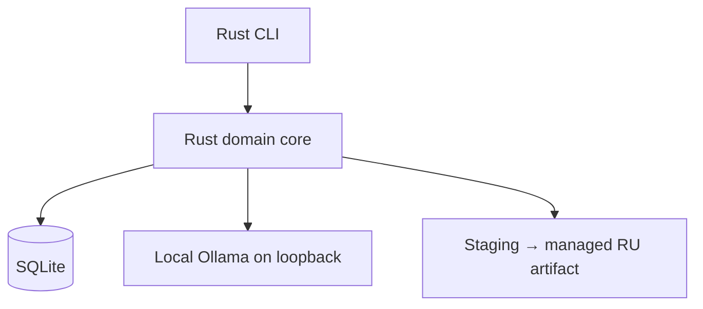

# Архитектура

## Архитектурный стиль

Система строится как модульный монолит: один Rust CLI-процесс, одно доменное ядро и одна локальная SQLite-база. CLI является adapter над ядром. Tauri/React могут быть добавлены позже как необязательный интерфейс без изменения parser, storage и publisher.

В поставляемом MVP нет собственного backend, listening-порта, облачного сервиса или bundled Python runtime. Установленный Ollama — отдельная локальная зависимость, доступная только через узкий loopback-adapter. Одноразовые Python-инструменты допустимы для исследования корпуса, но не входят в пользовательский runtime.



## Модули

| Модуль | Ответственность | Чего не делает |
|---|---|---|
| `cli` | команды, человекочитаемые планы и отчёты, подтверждение опасных переходов | не реализует parser, quality policy или прямую запись в источники |
| `workspace` | установки, manifests, canonical roots, version profiles, immutable source generations | не пишет в исходные каталоги |
| `stellaris-loc` | byte-level чтение, lossless CST, typed markup и controlled render | не вызывает модель |
| `context` | ссылки из scripts, тип сущности, speaker/event chain, соседние единицы и fingerprints | не изменяет script-файлы |
| `translation` | glossary/memory retrieval, локальный provider port, draft/review/repair | не получает файловых инструментов |
| `quality` | structural, semantic, lore/terminology и Russian-language findings | не выдаёт машинный текст за редакционно одобренный |
| `storage` | SQLite migrations, jobs, units, provenance, backups и artifacts | не хранит сырые тексты в обычных логах |
| `publisher` | staging, полная проверка, versioned output, activation и rollback | не активирует частичный или непроверенный результат |

Зависимости направлены внутрь: CLI, Ollama adapter и будущий UI зависят от доменных контрактов. Parser, validator и модель данных не знают о конкретном интерфейсе или названии LLM.

## Безопасный конвейер

1. **Discover.** Выбранные каталоги превращаются в явный playset manifest. Пути проверяются относительно разрешённых roots; canonical staging/output roots не могут совпадать, содержать или находиться внутри source, Workshop, game и immutable-snapshot roots. Любой overlap, symlink, traversal или неоднозначная принадлежность блокирует задание.
2. **Snapshot.** Файл читается один раз, а фактически прочитанные байты, metadata и hash сохраняются как immutable content-addressed generation. Если стабильное чтение невозможно или Workshop меняет источник, задание прерывается и строит новый generation.
3. **Parse.** Localisation разбирается в concrete syntax tree, сохраняющий BOM, newline, пробелы, комментарии, порядок, дубли ключей, version suffix и исходные escapes.
4. **Atomize.** Переменные, scripted localisation, icons, format spans и escapes становятся типизированными непрозрачными атомами. Неизвестная конструкция получает blocker и не передаётся как редактируемый текст.
5. **Contextualize.** Из immutable generation выбранного playset собирается минимальный контекст: тип объекта, связанные ключи, speaker, соседние реплики, зависимости и релевантные термины.
6. **Plan.** Diff engine классифицирует units как `unchanged`, `new`, `changed`, `moved`, `deleted`, `context_changed`, `policy_changed`, `ambiguous` или `blocked`.
7. **Translate.** Выбранная локальная модель получает schema-bound payload с человеческими сегментами и atom IDs. Текст мода помечается как недоверенные данные. Tool calls и доступ к файлам отсутствуют.
8. **Review.** Независимые проверки формируют findings. Repair получает конкретный defect contract; слепой повтор того же prompt запрещён.
9. **Render.** Только разрешённые human spans заменяются в копии CST. Заголовок, путь и output layout задаются version/export profile.
10. **Validate.** Проверяются round-trip invariants, keys, occurrences, atoms, numbers, encoding, coverage, semantics и output containment. Source generation повторно подтверждается перед публикацией.
11. **Build.** Полный кандидат собирается в новом versioned staging directory и получает manifest, hashes и validation report.
12. **Publish.** Platform-specific protocol активирует только проверенный version. Предыдущий last-known-good сохраняется до успешного smoke; при неясной семантике файловой системы операция останавливается.

`Build` и `Publish` — разные операции. Проект не обещает универсальную атомарную замену непустого каталога одной командой файловой системы; конкретный протокол и crash matrix фиксируются после M1 spike.

## Идентичность и инвалидация

Текст строки недостаточен для идентичности перевода. При этом parser version не должен притворяться изменением исходного текста, а positional occurrence index не является устойчивым ID.

```text
document_id = hash(mod_stable_id, normalized_relative_path)
raw_source_hash = hash(exact_source_bytes)
semantic_source_fingerprint = hash(key, parsed_human_spans, typed_atoms)
context_fingerprint = hash(normalized_entity_context, bounded_neighbours, relevant_dependency_slices)
policy_fingerprint = hash(version_profile, selected_glossary_entries, applicable_quality_rules)
```

`parser_version`, полные dependency generations, glossary version и quality-profile version хранятся отдельными полями provenance. Fingerprints включают только доказанно релевантные slices, фактически выбранные glossary entries и применимые rules. Reparse или нерелевантное глобальное изменение может потребовать audit, но не объявляет автоматически каждую строку новой либо требующей LLM-work.

Все duplicate occurrences сохраняются как факты источника. Stable matching использует path/key, raw и semantic fingerprints, ограниченный соседний контекст и явную диагностику неоднозначности. До подтверждения фактической load-order семантики движка ни одно совпадение не угадывается.

## Состояние и резервное копирование

SQLite хранит:

- установки, playsets и version profiles;
- source mods, dependencies и immutable generations;
- documents, units, occurrences, contexts и findings;
- glossary entries, forms, aliases, lore decisions и provenance;
- translation memory, manual overrides и editorial states;
- persistent jobs, attempts, checkpoints и usage;
- versioned artifacts, activation history и last-known-good.

Принятые переводы и решения являются пользовательскими данными, а не расходным кэшем. Система предоставляет проверяемый export/backup и restore до первого массового использования. Репозиторий не является резервной копией пользовательского workspace.

## Local Ollama boundary

MVP допускает только provider с доказанной локальной residency:

- endpoint обязан разрешаться в loopback (`127.0.0.1` или `::1`) без redirect;
- tag должен существовать в локальном inventory до начала задания;
- `*-cloud`, remote endpoint, неизвестный tag или неизвестная residency отклоняются;
- приложение не выполняет pull и не подбирает замену автоматически;
- перед запуском фиксируются полный model digest, Ollama version, options, context size, prompt/template и schema versions;
- изменение digest или значимого параметра создаёт новый quality profile и требует релевантного benchmark/review;
- ответ модели никогда не является инструкцией для системы и проходит typed validation.

Loopback endpoint сам по себе не доказывает локальную обработку, поэтому проверяются и endpoint, и конкретная модель. Дополнительная глобальная настройка Ollama local-only может использоваться как defense in depth после M1 threat review, но не заменяет проверки приложения.

## Форма выходного артефакта

Внутренняя идентичность, история, glossary и provenance всегда разделены по source mod. Форма экспорта является сменной versioned policy:

- `per-source` — отдельный companion на каждый мод;
- `playset-bundle` — один управляемый RU bundle для выбранного playset;
- `hybrid` — bundle с отдельными исключениями.

Рабочая гипотеза MVP — один RU bundle на playset, чтобы не создавать десятки launcher entries. M1 обязан проверить load order, `replace/`, cross-mod duplicate keys, удаление, отключение источника и rollback. Неоднозначный конфликт блокирует публикацию до явного правила победителя.

## Границы доверия

- исходный мод, descriptor, строки, имена файлов и зависимости недоверенны;
- операции выполняются над immutable generation, а не над меняющимся Workshop-каталогом;
- запись разрешена только в новый staging version и управляемый output root, которые доказанно disjoint со всеми source/game/snapshot roots;
- Ollama не может выбирать пути, инициировать команды или менять структуру;
- cloud и remote providers отсутствуют в MVP;
- неизвестный синтаксис и неоднозначный load order fail closed;
- публикация требует отдельного технического gate, а `editorially_approved` — человеческого решения.

## Эволюция

Version profiles, validators, context extractors и export policies являются расширяемыми портами. Tauri UI, другая платформа или cloud provider возможны только после стабильного M5 и отдельного ADR, если они не ослабляют каноны и действительно решают измеренную проблему.
