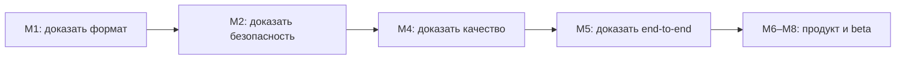

# Дорожная карта

Roadmap показывает порядок решений, а не обещанные даты. Статус M0 станет `accepted` после принятия и слияния документационного PR; остальные этапы не начаты.

| Milestone | Результат | Зависит от | Шлюз перехода | Статус |
|---|---|---|---|---|
| M0 — Decision baseline | стратегия, аудит, архитектура, стек, каноны и план | — | владелец принимает направление либо возвращает конкретные решения на пересмотр | proposed |
| M1 — Format & threat evidence | version profile, corpus, threat model, parser/packaging spikes | M0 | формат и companion deployment доказуемы на реальной установке | not started |
| M2 — Safety kernel | lossless CST, typed markup, controlled render, containment | M1 | 100% поддержанного корпуса проходит round-trip и adversarial gates | not started |
| M3 — Incremental project engine | snapshots, context identity, SQLite jobs, atomic artifacts | M2 | unchanged = zero work; crash/update/delete/rollback безопасны | not started |
| M4 — Translation quality engine | official corpus, glossary, memory, context, Ollama, review/repair | M3 | нет критических смысловых ошибок в размеченном golden corpus | not started |
| M5 — CLI vertical slice | полный конвейер на пилотных классах модов | M4 | безопасные компаньоны создаются и обновляются end-to-end | not started |
| M6 — Desktop workflow | folder picker, analysis, Translate all, progress, review, rollback | M5 | пользователь проходит сценарий без terminal и без обхода gates | not started |
| M7 — Production candidate | packages, signing, privacy, recovery, CI matrix, docs | M6 | чистая установка/обновление/откат и threat review пройдены | not started |
| M8 — Closed beta | разнообразный corpus и quality/performance calibration | M7 | выполнены beta exit criteria; принято отдельное release decision | not started |
| M9 — Public release | подписанный стабильный продукт и version-profile process | M8 | только явное решение владельца после отчёта beta | not started |

## Точки управленческого решения

### D0 — Начинать ли разработку

Принимается после M0. Одобрение означает финансирование только M1–M2 как доказательства основы, а не обещание довести продукт до релиза любой ценой.

### D1 — Достаточно ли понятен реальный формат

После M1 выбирается одно:

- продолжить к safety kernel;
- сузить поддерживаемый профиль;
- остановить проект, если безопасный companion deployment или parser экономически неразумны.

### D2 — Доказана ли техническая безопасность

После M2 запрещено переходить к массовому переводу при silent data loss, неполном markup coverage или недоказанном output containment.

### D3 — Достижимо ли нужное качество

После M4/M5 сравниваются локальный и облачный режимы, стоимость, скорость, доля fallback и человеческая оценка. Возможные решения: продолжить desktop, оставить expert CLI, сузить типы модов или остановить продукт.

### D4 — Готова ли beta к публичному продукту

После M8 владелец получает evidence report: совместимость, дефекты, качество, privacy, стоимость поддержки профилей и незакрытые риски. Только этот отчёт разрешает M9.

## Критический путь

UI, дополнительные providers, агрегированный экспорт и поддержка других игр не должны обходить этот путь.

## Критерии немедленной остановки и пересмотра

- источник был изменён хотя бы в одном тесте;
- parser молча теряет или нормализует неизвестные байты;
- модель может изменить служебную структуру вне controlled renderer;
- обновление нельзя сделать идемпотентным и откатываемым;
- golden corpus показывает систематические критические искажения смысла без приемлемого fallback;
- законное использование корпуса или выбранных зависимостей не подтверждено;
- поддержка новой версии Stellaris требует ручного переписывания ядра вместо version profile.

## Что не планируется до M5

- визуальная полировка beyond минимального test harness;
- Steam Workshop publishing;
- командная синхронизация;
- собственный model runtime;
- плагины для других игр;
- vector database;
- микросервисы или удалённая backend-инфраструктура.

