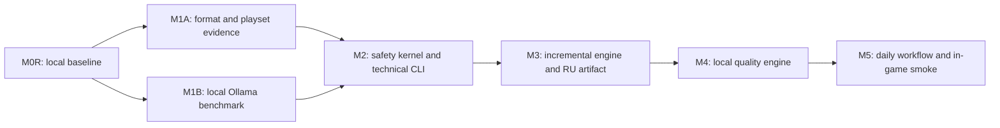

# Дорожная карта

Roadmap показывает порядок решений, а не даты. Первоначальный M0 был слит, но его desktop/public scope заменён уточнённым владельцем персональным baseline. Текущий `M0R` считается принятым только после review и merge этого remediation.

| Milestone | Результат | Зависит от | Шлюз перехода | Статус |
|---|---|---|---|---|
| M0 — Initial decision baseline | первоначальные стратегия, аудит, архитектура и план | — | исторический baseline слит, но scope пересмотрен | merged / superseded |
| M0R — Personal local baseline | owner decision, CLI/Ollama-only scope, исправленные каноны и evidence | M0 | документы согласованы и remediation merged | in progress |
| M1A — Format & playset evidence | threat model, format/markup specs, corpus, read-only load-order evidence и изолированные export-policy spikes | M0R | verdict `GO` разрешает совместный gate; `BLOCKED` останавливает ветку | not started |
| M1B — Local quality feasibility | benchmark установленных локальных моделей на human-reviewed corpus | M0R | verdict `QUALITY_FEASIBLE` разрешает совместный gate; `QUALITY_NOT_FEASIBLE` останавливает ветку | not started |
| M2 — Safety kernel & technical CLI | lossless CST, typed atoms, controlled render, containment | M1A, M1B | одновременно получены `GO` и `QUALITY_FEASIBLE`; taxonomy/holdout проходят technical gates | not started |
| M3 — Incremental engine & publishing | SQLite, identity, jobs, backup, versioned artifact и rollback | M2 | unchanged = zero work; crash/update/conflict/restore безопасны | not started |
| M4 — Local quality engine | context, glossary, memory, Ollama, review/repair и editorial states | M1B, M3 | quality thresholds и human-review policy соблюдены | not started |
| M5 — Daily CLI workflow | личный playset end-to-end и in-game smoke | M4 | повседневный update/rollback безопасен и принят владельцем | not started |
| M6? — Optional interface decision | только доказанное улучшение UX либо отказ от UI | M5 | отдельный owner decision и ADR | optional / not planned |

## Точки решения

### D0R — Принят ли персональный baseline

После M0R владелец разрешает только M1A и M1B. Это не разрешение писать весь продукт или добавлять UI.

### D1A — Достаточно ли понятны формат и candidate layout

После M1A выставляется `GO` либо `BLOCKED`. `GO` означает готовность format-ветви к совместному gate с M1B. Невозможность доказать безопасный candidate layout без записи в active paths даёт `BLOCKED`; принятие такого отчёта не разрешает M2.

### D1B — Достижимо ли качество локально

После M1B выставляется `QUALITY_FEASIBLE` с baseline model/profile и разрешёнными классами текста либо `QUALITY_NOT_FEASIBLE`. Только сочетание `M1A: GO` и `M1B: QUALITY_FEASIBLE` разрешает M2; отрицательный verdict останавливает реализацию до safety kernel.

### D2 — Доказана ли техническая безопасность

M3 запрещён при silent data loss, неполной taxonomy, недоказанном containment или mixed source generation.

### D3 — Готов ли процесс для личной игры

После M5 владелец принимает ежедневный CLI workflow, список ограничений и backup/rollback. UI не требуется для успеха MVP.

## Критический путь

M1A и M1B могут идти параллельно. M4 требует и доказанного качества модели, и безопасного project engine. UI, другие платформы и cloud не обходят этот путь.

## Рекомендации моделей Codex

Каждое сгенерированное задание обязано повторять выбранную строку этой таблицы. Это рекомендации для Codex-разработки, не модели Ollama.

| Работа | Рекомендуемый Codex |
|---|---|
| M0R, M1A/M1B, threat model, benchmark methodology и acceptance | `GPT-5.6 Sol, Ultra` |
| M2 parser/renderer/containment и M3 identity/publish/rollback | `GPT-5.6 Sol, Ultra` |
| Ограниченная реализация после утверждённого контракта | `GPT-5.6 Sol, High` или `Max`, затем Sol Ultra для safety gate |
| M4 semantic/lore policy и финальная редакционная оценка | `GPT-5.6 Sol, Ultra` плюс человеческое решение |
| Механические fixtures, повторяющиеся тесты и форматирование docs | `GPT-5.6 Terra, Medium` или `High`, затем Sol review для gate-critical изменений |
| M5 final end-to-end gate | `GPT-5.6 Sol, Ultra` |

`Ultra` — название уровня рассуждения в текущей Codex-среде владельца. Если в конкретной среде уровень недоступен, задание указывает фактически выбранный ближайший максимальный уровень и не снижает acceptance criteria. По официальной модели ролей Sol предназначен для frontier-quality работы, Terra — для сбалансированных bounded workloads; самый высокий effort резервируется для действительно сложных quality-first gates: [OpenAI model guidance](https://developers.openai.com/api/docs/guides/model-guidance?model=gpt-5.6).

## Немедленная остановка и пересмотр

- источник изменён хотя бы в одном тесте;
- Workshop update создаёт mixed generation;
- parser молча теряет или нормализует неизвестные байты;
- модель может изменить структуру вне controlled renderer;
- `*-cloud`, remote или unknown-residency модель принимается как локальная;
- конфликт load order разрешается недетерминированно;
- crash оставляет частично активный artifact;
- backup/restore не сохраняет manual/editorial work;
- holdout показывает критические false accepts или систематически плохой русский без безопасного fallback;
- следующий этап требует ослабить канон вместо предоставить evidence.

## Не планируется до M5

- desktop UI и визуальная полировка;
- Windows/Linux;
- Steam Workshop publishing;
- cloud providers, аккаунты или синхронизация;
- другой game profile;
- vector database;
- микросервисы или удалённая инфраструктура;
- публичная beta и release packaging.
