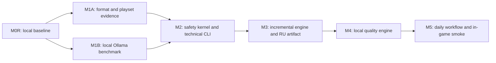

# Дорожная карта

Roadmap показывает порядок решений, а не даты. Первоначальный M0 был слит, но его desktop/public scope заменён уточнённым владельцем персональным baseline. `M0R` принят и слит в [PR #2](https://github.com/elenandar/Stellaris-mod-translator/pull/2), merge commit [`8d468b7`](https://github.com/elenandar/Stellaris-mod-translator/commit/8d468b7b8ca1f748dda8c072ce02933b15656dc2).

| Milestone | Результат | Зависит от | Шлюз перехода | Статус |
|---|---|---|---|---|
| M0 — Initial decision baseline | первоначальные стратегия, аудит, архитектура и план | — | исторический baseline слит, но scope пересмотрен | merged / superseded |
| M0R — Personal local baseline | owner decision, CLI/Ollama-only scope, исправленные каноны и evidence | M0 | документы согласованы и remediation merged | accepted — [PR #2](https://github.com/elenandar/Stellaris-mod-translator/pull/2) / [`8d468b7`](https://github.com/elenandar/Stellaris-mod-translator/commit/8d468b7b8ca1f748dda8c072ce02933b15656dc2) |
| M1A — Format & playset evidence | threat model, format/markup specs, corpus, read-only load-order evidence и изолированные export-policy spikes | M0R | verdict `GO` разрешает совместный gate; `BLOCKED` останавливает ветку | **BLOCKED** — evidence [PR #3](https://github.com/elenandar/Stellaris-mod-translator/pull/3) и hardening [PR #4](https://github.com/elenandar/Stellaris-mod-translator/pull/4) merged as [`9cd10d1fd3c9b52354ea4a5c181b0ecaf9c05240`](https://github.com/elenandar/Stellaris-mod-translator/commit/9cd10d1fd3c9b52354ea4a5c181b0ecaf9c05240) |
| M1B — Local quality feasibility | benchmark установленных локальных моделей на human-reviewed corpus | M0R | verdict `QUALITY_FEASIBLE` разрешает совместный gate; `QUALITY_NOT_FEASIBLE` останавливает ветку | PR #5 proposal, owner-freeze PR #6, stable-read PR #7, contract PR #8 и AUTH PR #9 merged; `OWNER_FREEZE: ACCEPTED`; `STABLE_READ_HARDENING: ACCEPTED`; `M1B-1A0 CONTRACT: ACCEPTED/MERGED`; `M1B-1A1-AUTH: ACCEPTED/MERGED`; `M1B-1A1 CANDIDATE: READY_FOR_OWNER_REVIEW`; `CANDIDATE CONSTRUCTION: COMPLETE_WITHIN_EXACT_INERT_SCOPE`; `CANDIDATE SOURCE: NOT_PARSED_NOT_COMPILED_NOT_IMPORTED_NOT_EXECUTED`; `PROPOSED EXECUTABLE MANIFEST: REVIEWABLE_PROPOSAL_ONLY_NOT_ADMISSION`; `RUNTIME_ENVELOPE_CONSTRUCTION: NOT_AUTHORIZED`; executable TCB admission не выдан; `M1B: NOT_EVALUATED`; benchmark не запускался |
| M2 — Safety kernel & technical CLI | lossless CST, typed atoms, controlled render, containment | M1A, M1B | одновременно получены `GO` и `QUALITY_FEASIBLE`; taxonomy/holdout проходят technical gates | **FORBIDDEN**: M1A is `BLOCKED`; M1B is `NOT_EVALUATED` |
| M3 — Incremental engine & publishing | SQLite, identity, jobs, backup, versioned artifact и rollback | M2 | unchanged = zero work; crash/update/conflict/restore безопасны | not started |
| M4 — Local quality engine | context, glossary, memory, Ollama, review/repair и editorial states | M1B, M3 | quality thresholds и human-review policy соблюдены | not started |
| M5 — Daily CLI workflow | личный playset end-to-end и in-game smoke | M4 | повседневный update/rollback безопасен и принят владельцем | not started |
| M6? — Optional interface decision | только доказанное улучшение UX либо отказ от UI | M5 | отдельный owner decision и ADR | optional / not planned |

Предварительный M1B protocol зафиксирован в [benchmark contract](specs/m1b-benchmark-contract.md), [corpus policy](m1b-corpus-policy.md), [quality rubric](specs/m1b-quality-rubric.md) и [threat model](m1b-threat-model.md). Proposal v7/generation 108 смержен в [PR #5](https://github.com/elenandar/Stellaris-mod-translator/pull/5) как [`ed07bcc`](https://github.com/elenandar/Stellaris-mod-translator/commit/ed07bcca96945dbb49206c975908e00c832210b5). Его review и merge не являются запуском benchmark и не выставляют feasibility verdict.

### M1B-0F — external owner-freeze

[External owner-freeze contract](specs/m1b-owner-freeze-contract.md) и
[owner signoff](decisions/M1B-0F-owner-signoff.md) фиксируют отдельное решение:
exact declarative proposal v7/generation 108 принят как basis подготовки
M1B-1A. Existing 17 M1B-0 entries остаются `proposed`; отдельный snapshot с
`acceptance_state=owner_accepted` связывает их exact identities canonical
digest `df84871be332ee52c315d0c0cc1a7a0046251352a2a0131382b5cb994cffcb58`.

Accepted declarative freeze действует только в exact declarative scope после merge
[PR #6](https://github.com/elenandar/Stellaris-mod-translator/pull/6) как
[`9f854da`](https://github.com/elenandar/Stellaris-mod-translator/commit/9f854da7501dec6ec9afc5e4bf71dfaa1ea9ecbc);
`OWNER_FREEZE: ACCEPTED`. Stable-reader hardening [PR #7](https://github.com/elenandar/Stellaris-mod-translator/pull/7)
head `4c849f5` merged в `main` как [`424a4e4`](https://github.com/elenandar/Stellaris-mod-translator/commit/424a4e45066cfbff3f9b3da2ec2cf6ad62a643fb);
`STABLE_READ_HARDENING: ACCEPTED`. Он не меняет owner decision, registry
snapshot, bundle identities, acceptance scope или authorization booleans.

### M1B-1A0 — offline executable/TCB admission contract

[Offline executable/TCB contract](specs/m1b-offline-executable-tcb-admission-contract.md)
и [review record](decisions/M1B-1A0-contract-review.md) задают отдельные
contract v4/version v4/generation 4, manifest v1 verifier, execution envelope
v4, execution plan v3/generation 3 и runtime acceptance v1 для будущего exact
executable/runtime admission. Final v4 identities и validation evidence
зафиксированы в review record после post-remediation revalidation.
[PR #8](https://github.com/elenandar/Stellaris-mod-translator/pull/8) exact head
`6a2243ad803bf47056f2577013053b6abc2df020` merged в `main` как
[`bfe3faa`](https://github.com/elenandar/Stellaris-mod-translator/commit/bfe3faaaf1c13021f4ecc62b7c584bc28ba964bc).
Это приняло только contract: `M1B-1A0 CONTRACT: ACCEPTED/MERGED`; executable или
runtime admission не выдан.

Generation 4 использует `m1b-execution-envelope-v4`, closed
`m1b-execution-plan-v3` и отдельный
`m1b-runtime-execution-envelope-acceptance-v1`. Typed repository locators
отделены от OS exec target, `argv[0]`, cwd и `sys_path`; exact argv принимает
provider harness только как cached admitted bytes через `/dev/fd/3` и bounded
atomic pipe preload с pre/post FIFO/access/inheritability/physical-identity
checks и controlled substitution rejection. Ordered role imports покрывают
остальные три manifest roles. Closed default-deny file-purpose matrix разрешает
только точные role/plan/source, provider/entrypoint/transport и
interpreter/invocation/builtin-frozen связи; standalone source/extension/native
reuse запрещён. Отдельные lexical/physical directory indices открывают cwd и
каждый sys_path descriptor-rooted stable nofollow и запрещают exact/physical
cwd/sys reuse; directory snapshot не доказывает import transport.
Provider harness entrypoint дополнительно требует raw relative path, первый
ASCII byte которого не `-`; coherent option-like paths (`-c`, `-m`, `-`, `--`,
`-E`) не могут обойти script argv grammar.
Caller-supplied runtime record остаётся только linkage evidence: external
owner-controlled decision — отдельный trust root. Interpreter path exec,
launcher opened-byte handoff, exact admitted-CPython provider source eligibility
и role-import transport остаются explicit blockers. Host `ast`/`compile` не
доказывают source eligibility, а synthetic invalid bytes могут подтвердить
только structural conformance при сохранённом blocker. Caller-supplied
`owner_accepted` означает только shape/linkage, не operational owner decision.

После merge PR #8 состояния: `EXECUTABLE_TCB_ADMISSION: NOT_GRANTED`,
`EXECUTABLE_TCB_OWNER_DECISION_REQUIRED: PRESERVED`,
`PROVIDER_ENTRYPOINT_SOURCE_ELIGIBILITY_UNPROVEN: PRESERVED`,
`EXECUTABLE_IMPLEMENTATION_IDENTITY_UNPROVEN: PRESERVED` и
`M1B-1A PROVIDER EXECUTION: NOT_STARTED`.

### M1B-1A1-AUTH — bounded candidate-construction authorization

[Canonical scope](../registry/m1b/m1b-1a1-candidate-construction-scope-v2.json),
[authorization contract](specs/m1b-1a1-candidate-construction-authorization-contract.md),
[machine owner record](decisions/M1B-1A1-AUTH-owner-authorization.json) и
[owner signoff](decisions/M1B-1A1-AUTH-owner-signoff.md) подготавливают только
ограниченный future construction scope. Scope generation `2` exact bind-ит
`18` read-only base inputs, `4` post-merge AUTH inputs, `4` inert role paths,
`4` create-only future directories и `12` future output paths.

Machine record содержит `acceptance_state=owner_accepted`, а exact effect
`after_review_and_merge_to_main` завершён merge PR #9. Текущий status:
`M1B-1A1-AUTH: ACCEPTED/MERGED`.

После effect отдельный M1B-1A1 может создать только четыре inert role files,
proposed manifest, synthetic fixture README/data, candidate review, sanitized
ignored evidence и три status-only updates из exact allowlist. `cases.json`
остаётся инертными данными. Четыре отсутствующих каталога создаются только по
exact create-only allowlist с modes `0700`/`0755`; любой другой каталог
запрещён. Repository content plane остаётся default-deny, а отдельно
перечисленные Git/GitHub operations и host validation доступны только после
effect и не становятся candidate/provider authority.

Новый repository test, другой executable fixture, import или execution любого
созданного repository file, а также parse/compile candidate source запрещены.
Future static data/Markdown validation выполняют только существующие host tools
с `PYTHONDONTWRITEBYTECODE=1`, без `.pyc`/`__pycache__`. Proposed manifest не
является admission.
Execution/runtime envelope, invocation plan, implementation/runtime acceptance,
candidate/provider runtime interpreter selection/copy, interpreter admission,
provider/Ollama/model action, corpus, benchmark, product CLI, M2, activation и
publishing запрещены. Bounded system validation-tool selection/исполнение не
является runtime authority. Поэтому
`NEW REPOSITORY CODE EXECUTION: NOT_AUTHORIZED` и
`RUNTIME_ENVELOPE_CONSTRUCTION: NOT_AUTHORIZED` сохраняются.

M1B-1A1 не может принять созданные identities. Только отдельный будущий
M1B-1A2 может рассмотреть owner-controlled решение над уже известными exact
identities; даже он не разрешает provider/model call, private corpus или
benchmark без следующего explicit execution gate. States остаются
`M1B: NOT_EVALUATED`, `M1A: BLOCKED`, `M2: FORBIDDEN`.

### M1B-1A1 — exact inert four-role candidate construction

[Candidate review](decisions/M1B-1A1-candidate-review.md),
[proposed executable manifest](../registry/m1b/m1b-1a1-proposed-executable-manifest-v1.json)
и [inert synthetic fixture](../fixtures/m1b/candidate-construction/README.md)
имеют status `M1B-1A1 CANDIDATE: READY_FOR_OWNER_REVIEW`.
`CANDIDATE CONSTRUCTION: COMPLETE_WITHIN_EXACT_INERT_SCOPE`;
`CANDIDATE SOURCE: NOT_PARSED_NOT_COMPILED_NOT_IMPORTED_NOT_EXECUTED`;
`PROPOSED EXECUTABLE MANIFEST: REVIEWABLE_PROPOSAL_ONLY_NOT_ADMISSION`;
`NEW REPOSITORY CODE EXECUTION: NOT_AUTHORIZED`;
`RUNTIME_ENVELOPE_CONSTRUCTION: NOT_AUTHORIZED`;
`EXECUTABLE_TCB_ADMISSION: NOT_GRANTED`;
`M1B-1A PROVIDER EXECUTION: NOT_STARTED`;
`M1B: NOT_EVALUATED`; `M1A: BLOCKED`; `M2: FORBIDDEN`.

## Точки решения

### D0R — Принят ли персональный baseline

После M0R владелец разрешает только M1A и M1B. Это не разрешение писать весь продукт или добавлять UI.

### D1A — Достаточно ли понятны формат и candidate layout

После M1A выставляется `GO` либо `BLOCKED`. `GO` означает готовность format-ветви к совместному gate с M1B. Невозможность доказать безопасный candidate layout без записи в active paths даёт `BLOCKED`; принятие такого отчёта не разрешает M2.

### D1B — Достижимо ли качество локально

После M1B выставляется `QUALITY_FEASIBLE` с baseline model/profile и разрешёнными классами текста либо `QUALITY_NOT_FEASIBLE`. Только сочетание `M1A: GO` и `M1B: QUALITY_FEASIBLE` разрешает M2; отрицательный verdict останавливает реализацию до safety kernel.

### D2 — Доказана ли техническая безопасность

M3 запрещён при silent data loss, неполной taxonomy, недоказанном containment или mixed source generation.

### D3 — Готов ли процесс для личной игры

После M5 владелец принимает ежедневный CLI workflow, список ограничений и backup/rollback. UI не требуется для успеха MVP.

## Критический путь

M1A и M1B могут идти параллельно. M4 требует и доказанного качества модели, и безопасного project engine. UI, другие платформы и cloud не обходят этот путь.

## Рекомендации моделей Codex

Каждое сгенерированное задание обязано повторять выбранную строку этой таблицы. Это рекомендации для Codex-разработки, не модели Ollama.

| Работа | Рекомендуемый Codex |
|---|---|
| M0R, M1A/M1B, threat model, benchmark methodology и acceptance | `GPT-5.6 Sol, Ultra` |
| M2 parser/renderer/containment и M3 identity/publish/rollback | `GPT-5.6 Sol, Ultra` |
| Ограниченная реализация после утверждённого контракта | `GPT-5.6 Sol, High` или `Max`, затем Sol Ultra для safety gate |
| M4 semantic/lore policy и финальная редакционная оценка | `GPT-5.6 Sol, Ultra` плюс человеческое решение |
| Механические fixtures, повторяющиеся тесты и форматирование docs | `GPT-5.6 Terra, Medium` или `High`, затем Sol review для gate-critical изменений |
| M5 final end-to-end gate | `GPT-5.6 Sol, Ultra` |

`Ultra` — название уровня рассуждения в текущей Codex-среде владельца. Если в конкретной среде уровень недоступен, задание указывает фактически выбранный ближайший максимальный уровень и не снижает acceptance criteria. По официальной модели ролей Sol предназначен для frontier-quality работы, Terra — для сбалансированных bounded workloads; самый высокий effort резервируется для действительно сложных quality-first gates: [OpenAI model guidance](https://developers.openai.com/api/docs/guides/model-guidance?model=gpt-5.6).

## Немедленная остановка и пересмотр

- источник изменён хотя бы в одном тесте;
- Workshop update создаёт mixed generation;
- parser молча теряет или нормализует неизвестные байты;
- модель может изменить структуру вне controlled renderer;
- `*-cloud`, remote или unknown-residency модель принимается как локальная;
- конфликт load order разрешается недетерминированно;
- crash оставляет частично активный artifact;
- backup/restore не сохраняет manual/editorial work;
- holdout показывает критические false accepts или систематически плохой русский без безопасного fallback;
- следующий этап требует ослабить канон вместо предоставить evidence.

## Не планируется до M5

- desktop UI и визуальная полировка;
- Windows/Linux;
- Steam Workshop publishing;
- cloud providers, аккаунты или синхронизация;
- другой game profile;
- vector database;
- микросервисы или удалённая инфраструктура;
- публичная beta и release packaging.
