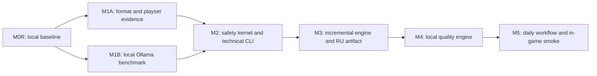

# Дорожная карта

Roadmap показывает порядок решений, а не даты. Первоначальный M0 был слит, но его desktop/public scope заменён уточнённым владельцем персональным baseline. `M0R` принят и слит в [PR #2](https://github.com/elenandar/Stellaris-mod-translator/pull/2), merge commit [`8d468b7`](https://github.com/elenandar/Stellaris-mod-translator/commit/8d468b7b8ca1f748dda8c072ce02933b15656dc2).

26 июля 2026 года владелец ввёл `MVP-0` как отдельный практический путь к
первому работающему переводчику. Это явное исключение из прежнего AUTH-first
порядка: оно разрешает только ограниченный Python CLI, synthetic tests,
loopback Ollama и отдельный candidate output. PR №11 и его AUTH/remediation
контур superseded для MVP-0 и не являются зависимостью. Старые M1A/M1B записи
ниже остаются историческим evidence, но не переносят сложный authorization
контур в MVP-0.

После merge MVP-0 владелец отдельно разрешил `MVP-1`: bounded pilot ровно одного
указанного private мода с read-only source, exact локальной Ollama-моделью и
отдельным no-clobber candidate. Bounded output служит только материалом для
human review; он не является полным переводом, active publish или
литературным approval.

После merge MVP-1 владелец отдельно разрешил `MVP-2`: автономный локальный
editorial review pack только для exact immutable pilot candidate. Этот слой
читает source/candidate только для проверки и review, не вызывает Ollama, не
применяет решения обратно и не разрешает полный перевод, launcher integration
или active publish.

MVP-2 слит в PR №14 как `c6788aab`; `pilot-01` superseded, а `pilot-02`
остаётся review source. После этого владелец отдельно разрешил synthetic-only
`MVP-3`: механизм применения полного decisions JSON к новому отдельному
reviewed candidate. Private decisions и real `pilot-02` в этом этапе не
читаются и не применяются. Даже результат будущего разрешённого запуска не
будет active mod или full-mod editorial approval.

MVP-3 слит в PR №15 как `4dc79f9c`. После этого владелец отдельно разрешил
synthetic-only `MVP-4`: optional SQLite workspace для полного `translate-mod`,
durable per-occurrence checkpoints, strict schema/type validation, bounded hot
journal rollback recovery, fail-fast systemic provider errors и recoverable
intent-before-publish finalization только после `pending=0`. Точная identity
всего output tree позволяет безопасно завершить post-publication crash без
новых model calls и без повторной публикации. Private mods, live Ollama,
`pilot-02`, active paths и launcher остаются вне этого этапа.

MVP-4 remediation дополнительно вводит sidecar-before-SQLite structural
preflight, process-lifetime advisory workspace lease, два независимых полных
descriptor-checked manifest-прохода опубликованного tree и идемпотентный
read-only resume уже `completed` workspace. Финальная узкая remediation
делегирует rollback прошедшего structural preflight journal самой SQLite,
доказывает настоящий commit-phase crash с изменённым page-1, отделяет
in-memory logical tree/identity от materialization и убирает Ollama dependency
из post-intent recovery. Полный synthetic baseline: `266 passed` с
warnings-as-errors. Остаётся явно принятое ограничение: эти проверки не
доказывают абсолютную защиту от hostile same-UID процесса, который сознательно
обходит advisory lease и подменяет состояние между проверками.

После merge MVP-4 владелец отдельно разрешил `MVP-5B`: локальный full-candidate
editorial review pack поверх schema v3 с обязательным pin точных report bytes,
масштабируемым автономным UI и private no-clobber output. Unsupported
occurrences остаются только summary residue без редактируемого span. Этот этап
не обобщает применение decisions, не меняет active installation, не добавляет
launcher и не выставляет `editorially_approved=true`; full application остаётся
отдельным MVP-5C.

После merge MVP-5B в PR №17 владелец отдельно разрешил `MVP-5C`: обобщение
`apply-review-decisions` на полный schema-v3 candidate с exact report pin,
полным exact-set decisions contract, lossless human-span application и
атомарной no-clobber публикацией нового reviewed candidate. Этап synthetic-only:
private localisation/review artifacts, реальный decisions JSON, Ollama,
launcher и active mod paths не читаются и не изменяются. Live application
требует отдельного следующего разрешения после review/merge механизма и
локального final export.

MVP-5C смержен в PR №18 как `43e0b5b`; затем exact full decisions set был
применён в отдельный private reviewed candidate с application report schema v2,
полным решением `1678 / 1678` reviewable occurrences и нулевыми
source/candidate/Ollama/network mutations. Technical residue
`11 unsupported / 1 skipped` сохранён явно, поэтому
`editorially_approved=false`. MVP-5D смержен в PR №19 как `80cae5a`; его
ускоренный review UI не меняет authority уже применённых human decisions.

После этого владелец отдельно разрешил `MVP-5H`: reusable packaging command и
ровно один private no-clobber NSC3 package вне active Stellaris paths.
Application report остаётся pinned metadata authority, а игровой content
ограничен строгими descriptors и byte-identical
`localisation/russian/**`. Package creation не является active installation и
не разрешает launcher/playset mutation или запуск игры. Следующий gate:
bounded установка exact пакета, расположение после NSC3 и внутриигровой smoke.

После merge MVP-5H владелец отдельно разрешил `MVP-5L`: native support только
для qualified replace layout `localisation/english/replace/**` с точным
candidate mapping в `localisation/russian/replace/**`. Файлы проходят
существующие lossless translation, resumable workspace, full review,
decision-application и reviewed-package gates без новой schema и без
`replace_path` в descriptor. Неоднозначный `localisation/replace/**` и
неканонические case/Unicode-варианты остаются явным technical residue без
provider calls или candidate bytes. Этап не удаляет и не мигрирует
существующий active replace-patch, не меняет launcher/playsets и не создаёт
новый private NSC3 candidate/package.

После merge MVP-5L владелец отдельно разрешил `MVP-5M`: trusted consolidation
основного reviewed candidate и exact owner-reviewed qualified replace
supplement в один fresh private no-clobber package. Две provenance-ветви и
алгебра `1678 + 9 + 11 = 1698` остаются явными; новый descriptor зависит только
от NSC3. Remediation отдельно bind-ит historical full-localisation identity,
bounded manifest всей текущей source generation, technical main-menu status и
authoritative owner visual confirmation. R2 уточняет authority новым
duplicate-free schema v2: `package_replace_entry_count=9`,
`verified_visual_target_count=3` и фиксированный content-free
`visual_scope_id=nsc3_corvette_core_module_labels_v1`. Новый package report
schema v4 / construction mode v3 сохраняет `reviewed_occurrences=9` как число
проверенных mappings и не переопределяет historical report schema v3. Этап не
переписывает старый application report, не создаёт фиктивный decisions set, не
удаляет прежние packages и не меняет active installation, launcher/playset или
load order.
Installation migration и повторный game smoke остаются отдельным следующим
gate.

После merge MVP-5M и принятого owner gameplay smoke владелец отдельно разрешил
`MVP-6A`: offline builder приватной version-pinned contextual vanilla memory.
Он читает только заданные English/Russian localisation roots, хранит exact
occurrences в private SQLite и публикует агрегированный report без content.
Память не является глобальным словарём, не подключена к `translate-mod` и не
разрешает automatic acceptance. До отдельного owner authorization `MVP-6B`
оставался самостоятельным read-only retrieval/ranking gate после review и
merge MVP-6A.

MVP-6A смержен в PR №23 как `de02dc2f`. После этого владелец отдельно разрешил
`MVP-6B`: read-only `exact_context_v1` retrieval и aggregate coverage exact
NSC3 без подключения memory к `translate-mod`, workspace, prompt или Ollama.
Exact-key context имеет приоритет; exact-text fallback требует strict
alias-free Russian-byte consensus. Все references остаются
`REFERENCE_ONLY`, `editorially_approved=false`, `auto_applied=false`, а
candidate model text существует только внутри процесса. Реальный smoke не
создаёт candidate/context-pack/workspace/evidence artifacts и не разрешает
prompt integration; это отдельный будущий MVP-6C gate.

После merge MVP-6B в PR №24 как `0237581b` владелец отдельно разрешил
`MVP-6C`: default-off prompt integration только для resumable workspace,
строгий source/memory/context binding через schema-v2 prompt profile hash,
contextual report schema v4 и bounded private blind A/B. Только два eligible
terminal statuses получают reference; остальные сохраняют exact legacy
request. Quality verdict и включение context по умолчанию остаются отдельным
owner decision после review code PR и локального A/B pack.

| Milestone | Результат | Зависит от | Шлюз перехода | Статус |
|---|---|---|---|---|
| MVP-6C — Optional exact-context prompt and bounded A/B | all-or-none opt-in `exact_context_v1`, canonical untrusted-data prompt, schema-v2 resume binding, schema-v4 aggregate-only context report и private offline blind pack | merged MVP-6B PR №24, exact memory/source/candidate pins и owner authorization | full synthetic suite, bounded 23-entry live pilot or explicit deferred evidence, external leakage scan и independent Sol High prompt/identity/resume review | **implemented for draft review; context remains default-off and quality requires owner blind review** |
| MVP-6B — Read-only contextual retrieval and coverage | typed `exact_context_v1`, deterministic key/text/path-family ranking, quarantine/alias/ambiguity suppression и aggregate-only source coverage | merged MVP-6A PR №23, exact schema-v3 memory pins и owner authorization | full synthetic suite, one immutable exact NSC3 aggregate run, external leakage scan и independent Sol High ranking/privacy review | **merged in PR №24 as `0237581b`; prompt integration is separately gated by MVP-6C** |
| MVP-6A — Private contextual vanilla memory | duplicate-aware exact-key alignment с conservative whole-file key occupancy, version suffix и ordered protected-atom gates, private SQLite, canonical logical digest и aggregate-only inspect | merged MVP-5M, owner gameplay smoke и exact Pegasus 4.4.6 EN/RU roots | full synthetic suite, immutable real-corpus manifests, private no-clobber build, leakage scan и bounded Sol Ultra diff-review | **merged in PR №23 as `de02dc2f`; memory remains private and reference-only** |
| MVP-5M — Trusted reviewed-package consolidation | две pinned provenance-ветви, full-localisation/source-generation binding, раздельные technical smoke, 9 reviewed mappings / 3 owner-confirmed visual targets и fresh atomic no-clobber native package | merged MVP-5L, exact reviewed candidate, owner-reviewed replace supplement, technical smoke evidence и owner visual confirmation schema v2 | adversarial/full suite, exact private pre/post identities and materialized-package recheck | **R2 authority-scope remediation implemented for draft review; active installation migration, launcher and game smoke are separate gates** |
| MVP-5L — Native qualified replace layer | exact `localisation/english/replace/**` discovery, collision-free mapping в `localisation/russian/replace/**` и сквозное сохранение через review/application/package | merged MVP-5H and verified canonical NSC3 source layout | synthetic lossless/collision/workspace/review/application/package suite, read-only aggregated NSC3 inspect and bounded Sol Ultra diff-review | **implemented for draft review; active patch migration, launcher and game smoke are separate gates** |
| MVP-5H — Safe local-mod package | exact application-report pin, strict reviewed inventory, typed descriptor renderer, metadata-only package report и atomic no-clobber package publication | merged MVP-5C/MVP-5D, exact private reviewed candidate and explicit owner authorization | full synthetic suite, private package smoke and immutability checks; затем отдельный live-install/load-order/in-game gate | **implemented for review; private NSC3 package smoke PASS, active installation and launcher remain untouched** |
| MVP-5D — Accelerated editorial workflow | paginated batch accept/reject, exact-set confirmation, atomic sparse state and bounded undo without automatic decisions | merged MVP-5C mechanism and owner-controlled private review | synthetic JS/browser regressions and complete human final export | **merged in PR №19 as `80cae5a`; no launcher or active installation** |
| MVP-5C — Full-candidate decision application | exact schema-v3 report pin, shared review validation, complete decisions set, lossless accept/edit/reject и full application report schema v2 | merged MVP-5B in PR №17 and schema-v3/full-pack contracts | full synthetic suite, adversarial semantic review; затем exact owner-authorized private application | **merged in PR №18 as `43e0b5b`; live decisions applied to a private reviewed candidate, active installation and launcher remain untouched** |
| MVP-5B — Full-candidate editorial review pack | strict schema-v3/report-pin validation, pack schema v2, warning flags, paginated UI, sparse persistence и draft/final decisions schema v1 export | merged MVP-4 at `81c9593` and exact immutable full candidate/report | full synthetic suite, browser smoke, exact private input recheck и local-only no-clobber pack | **merged in PR №17; no active installation or launcher** |
| MVP-4 — Resumable full-mod translation | private SQLite workspace, immutable job/model/source provenance, SQLite-authoritative hot-journal rollback after structural preflight, run-wide lease, in-memory logical output identity, offline post-intent recovery, stable two-pass reconciliation, write-free completed resume и crash-recoverable exact-tree atomic no-clobber finalization | merged MVP-3 at `4dc79f9c` | full synthetic suite; затем отдельное owner authorization для любого private/live full-mod run | **final remediation validated for synthetic data — 266 tests; commit-phase rollback/offline intent/read-only completion covered; same-UID limitation documented; no private reads, live Ollama calls or active publication** |
| MVP-3 — Apply editorial review decisions | complete decisions validation, occurrence-identity application, lossless human-span edits и atomic no-clobber reviewed candidate | merged MVP-2 and exact pilot-02 source/candidate/report identity | synthetic suite; затем completed human decisions JSON и отдельное owner authorization для live application | **mechanism implemented for synthetic review; private decisions not applied and output is not active** |
| MVP-2 — Local editorial review pack | pinned occurrence alignment, автономный CSP-safe `index.html`, локальные decisions import/export и atomic no-clobber publication | merged MVP-1 и exact immutable pilot identities | synthetic suite, offline/XSS/browser smoke, source/candidate/report identity и immutability recheck | **implemented — merged in PR №14 as `c6788aab`; pilot-02 remains local and human review is not full-mod approval** |
| MVP-1 — Bounded real-mod pilot | детерминированный per-file limit, отдельные deferred/fallback counters и небольшой private candidate для human review | merged MVP-0 и explicit owner consent для exact mod/model/path | synthetic suite, dry-run, source/model identity и candidate safety checks | **implemented — merged in PR #13 as `b5c9d942`; live pilot is technically safe with fallbacks and human review remains required** |
| MVP-0 — Safe translate-mod CLI | lossless supported-subset parser, exact local Ollama tag/digest, English fallback и атомарный отдельный RU candidate | явное owner decision | synthetic suite; затем ручной synthetic smoke и только после consent один private mod | **implemented — merged in PR #12** |
| M0 — Initial decision baseline | первоначальные стратегия, аудит, архитектура и план | — | исторический baseline слит, но scope пересмотрен | merged / superseded |
| M0R — Personal local baseline | owner decision, CLI/Ollama-only scope, исправленные каноны и evidence | M0 | документы согласованы и remediation merged | accepted — [PR #2](https://github.com/elenandar/Stellaris-mod-translator/pull/2) / [`8d468b7`](https://github.com/elenandar/Stellaris-mod-translator/commit/8d468b7b8ca1f748dda8c072ce02933b15656dc2) |
| M1A — Format & playset evidence | threat model, format/markup specs, corpus, read-only load-order evidence и изолированные export-policy spikes | M0R | verdict `GO` разрешает совместный gate; `BLOCKED` останавливает ветку | **BLOCKED** — evidence [PR #3](https://github.com/elenandar/Stellaris-mod-translator/pull/3) и hardening [PR #4](https://github.com/elenandar/Stellaris-mod-translator/pull/4) merged as [`9cd10d1fd3c9b52354ea4a5c181b0ecaf9c05240`](https://github.com/elenandar/Stellaris-mod-translator/commit/9cd10d1fd3c9b52354ea4a5c181b0ecaf9c05240) |
| M1B — Local quality feasibility | benchmark установленных локальных моделей на human-reviewed corpus | M0R | verdict `QUALITY_FEASIBLE` разрешает совместный gate; `QUALITY_NOT_FEASIBLE` останавливает ветку | PR #5 proposal, owner-freeze PR #6, stable-read PR #7, contract PR #8 и AUTH PR #9 merged; `OWNER_FREEZE: ACCEPTED`; `STABLE_READ_HARDENING: ACCEPTED`; `M1B-1A0 CONTRACT: ACCEPTED/MERGED`; `M1B-1A1-AUTH: ACCEPTED/MERGED`; `M1B-1A1 CANDIDATE: READY_FOR_OWNER_REVIEW`; `CANDIDATE CONSTRUCTION: COMPLETE_WITHIN_EXACT_INERT_SCOPE`; `CANDIDATE SOURCE: NOT_PARSED_NOT_COMPILED_NOT_IMPORTED_NOT_EXECUTED`; `PROPOSED EXECUTABLE MANIFEST: REVIEWABLE_PROPOSAL_ONLY_NOT_ADMISSION`; `RUNTIME_ENVELOPE_CONSTRUCTION: NOT_AUTHORIZED`; executable TCB admission не выдан; `M1B: NOT_EVALUATED`; benchmark не запускался |
| M2 — Safety kernel & technical CLI | lossless CST, typed atoms, controlled render, containment | M1A, M1B | одновременно получены `GO` и `QUALITY_FEASIBLE`; taxonomy/holdout проходят technical gates | **FORBIDDEN**: M1A is `BLOCKED`; M1B is `NOT_EVALUATED` |
| M3 — Incremental engine & publishing | SQLite, identity, jobs, backup, versioned artifact и rollback | M2 | unchanged = zero work; crash/update/conflict/restore безопасны | not started |
| M4 — Local quality engine | context, glossary, memory, Ollama, review/repair и editorial states | M1B, M3 | quality thresholds и human-review policy соблюдены | not started |
| M5 — Daily CLI workflow | личный playset end-to-end и in-game smoke | M4 | повседневный update/rollback безопасен и принят владельцем | not started |
| M6? — Optional interface decision | только доказанное улучшение UX либо отказ от UI | M5 | отдельный owner decision и ADR | optional / not planned |

Предварительный M1B protocol зафиксирован в [benchmark contract](specs/m1b-benchmark-contract.md), [corpus policy](m1b-corpus-policy.md), [quality rubric](specs/m1b-quality-rubric.md) и [threat model](m1b-threat-model.md). Proposal v7/generation 108 смержен в [PR #5](https://github.com/elenandar/Stellaris-mod-translator/pull/5) как [`ed07bcc`](https://github.com/elenandar/Stellaris-mod-translator/commit/ed07bcca96945dbb49206c975908e00c832210b5). Его review и merge не являются запуском benchmark и не выставляют feasibility verdict.

### M1B-0F — external owner-freeze

[External owner-freeze contract](specs/m1b-owner-freeze-contract.md) и
[owner signoff](decisions/M1B-0F-owner-signoff.md) фиксируют отдельное решение:
exact declarative proposal v7/generation 108 принят как basis подготовки
M1B-1A. Existing 17 M1B-0 entries остаются `proposed`; отдельный snapshot с
`acceptance_state=owner_accepted` связывает их exact identities canonical
digest `df84871be332ee52c315d0c0cc1a7a0046251352a2a0131382b5cb994cffcb58`.

Accepted declarative freeze действует только в exact declarative scope после merge
[PR #6](https://github.com/elenandar/Stellaris-mod-translator/pull/6) как
[`9f854da`](https://github.com/elenandar/Stellaris-mod-translator/commit/9f854da7501dec6ec9afc5e4bf71dfaa1ea9ecbc);
`OWNER_FREEZE: ACCEPTED`. Stable-reader hardening [PR #7](https://github.com/elenandar/Stellaris-mod-translator/pull/7)
head `4c849f5` merged в `main` как [`424a4e4`](https://github.com/elenandar/Stellaris-mod-translator/commit/424a4e45066cfbff3f9b3da2ec2cf6ad62a643fb);
`STABLE_READ_HARDENING: ACCEPTED`. Он не меняет owner decision, registry
snapshot, bundle identities, acceptance scope или authorization booleans.

### M1B-1A0 — offline executable/TCB admission contract

[Offline executable/TCB contract](specs/m1b-offline-executable-tcb-admission-contract.md)
и [review record](decisions/M1B-1A0-contract-review.md) задают отдельные
contract v4/version v4/generation 4, manifest v1 verifier, execution envelope
v4, execution plan v3/generation 3 и runtime acceptance v1 для будущего exact
executable/runtime admission. Final v4 identities и validation evidence
зафиксированы в review record после post-remediation revalidation.
[PR #8](https://github.com/elenandar/Stellaris-mod-translator/pull/8) exact head
`6a2243ad803bf47056f2577013053b6abc2df020` merged в `main` как
[`bfe3faa`](https://github.com/elenandar/Stellaris-mod-translator/commit/bfe3faaaf1c13021f4ecc62b7c584bc28ba964bc).
Это приняло только contract: `M1B-1A0 CONTRACT: ACCEPTED/MERGED`; executable или
runtime admission не выдан.

Generation 4 использует `m1b-execution-envelope-v4`, closed
`m1b-execution-plan-v3` и отдельный
`m1b-runtime-execution-envelope-acceptance-v1`. Typed repository locators
отделены от OS exec target, `argv[0]`, cwd и `sys_path`; exact argv принимает
provider harness только как cached admitted bytes через `/dev/fd/3` и bounded
atomic pipe preload с pre/post FIFO/access/inheritability/physical-identity
checks и controlled substitution rejection. Ordered role imports покрывают
остальные три manifest roles. Closed default-deny file-purpose matrix разрешает
только точные role/plan/source, provider/entrypoint/transport и
interpreter/invocation/builtin-frozen связи; standalone source/extension/native
reuse запрещён. Отдельные lexical/physical directory indices открывают cwd и
каждый sys_path descriptor-rooted stable nofollow и запрещают exact/physical
cwd/sys reuse; directory snapshot не доказывает import transport.
Provider harness entrypoint дополнительно требует raw relative path, первый
ASCII byte которого не `-`; coherent option-like paths (`-c`, `-m`, `-`, `--`,
`-E`) не могут обойти script argv grammar.
Caller-supplied runtime record остаётся только linkage evidence: external
owner-controlled decision — отдельный trust root. Interpreter path exec,
launcher opened-byte handoff, exact admitted-CPython provider source eligibility
и role-import transport остаются explicit blockers. Host `ast`/`compile` не
доказывают source eligibility, а synthetic invalid bytes могут подтвердить
только structural conformance при сохранённом blocker. Caller-supplied
`owner_accepted` означает только shape/linkage, не operational owner decision.

После merge PR #8 состояния: `EXECUTABLE_TCB_ADMISSION: NOT_GRANTED`,
`EXECUTABLE_TCB_OWNER_DECISION_REQUIRED: PRESERVED`,
`PROVIDER_ENTRYPOINT_SOURCE_ELIGIBILITY_UNPROVEN: PRESERVED`,
`EXECUTABLE_IMPLEMENTATION_IDENTITY_UNPROVEN: PRESERVED` и
`M1B-1A PROVIDER EXECUTION: NOT_STARTED`.

### M1B-1A1-AUTH — bounded candidate-construction authorization

[Canonical scope](../registry/m1b/m1b-1a1-candidate-construction-scope-v2.json),
[authorization contract](specs/m1b-1a1-candidate-construction-authorization-contract.md),
[machine owner record](decisions/M1B-1A1-AUTH-owner-authorization.json) и
[owner signoff](decisions/M1B-1A1-AUTH-owner-signoff.md) подготавливают только
ограниченный future construction scope. Scope generation `2` exact bind-ит
`18` read-only base inputs, `4` post-merge AUTH inputs, `4` inert role paths,
`4` create-only future directories и `12` future output paths.

Machine record содержит `acceptance_state=owner_accepted`, а exact effect
`after_review_and_merge_to_main` завершён merge PR #9. Текущий status:
`M1B-1A1-AUTH: ACCEPTED/MERGED`.

После effect отдельный M1B-1A1 может создать только четыре inert role files,
proposed manifest, synthetic fixture README/data, candidate review, sanitized
ignored evidence и три status-only updates из exact allowlist. `cases.json`
остаётся инертными данными. Четыре отсутствующих каталога создаются только по
exact create-only allowlist с modes `0700`/`0755`; любой другой каталог
запрещён. Repository content plane остаётся default-deny, а отдельно
перечисленные Git/GitHub operations и host validation доступны только после
effect и не становятся candidate/provider authority.

Новый repository test, другой executable fixture, import или execution любого
созданного repository file, а также parse/compile candidate source запрещены.
Future static data/Markdown validation выполняют только существующие host tools
с `PYTHONDONTWRITEBYTECODE=1`, без `.pyc`/`__pycache__`. Proposed manifest не
является admission.
Execution/runtime envelope, invocation plan, implementation/runtime acceptance,
candidate/provider runtime interpreter selection/copy, interpreter admission,
provider/Ollama/model action, corpus, benchmark, product CLI, M2, activation и
publishing запрещены. Bounded system validation-tool selection/исполнение не
является runtime authority. Поэтому
`NEW REPOSITORY CODE EXECUTION: NOT_AUTHORIZED` и
`RUNTIME_ENVELOPE_CONSTRUCTION: NOT_AUTHORIZED` сохраняются.

M1B-1A1 не может принять созданные identities. Только отдельный будущий
M1B-1A2 может рассмотреть owner-controlled решение над уже известными exact
identities; даже он не разрешает provider/model call, private corpus или
benchmark без следующего explicit execution gate. States остаются
`M1B: NOT_EVALUATED`, `M1A: BLOCKED`, `M2: FORBIDDEN`.

### M1B-1A1 — exact inert four-role candidate construction

[Candidate review](decisions/M1B-1A1-candidate-review.md),
[proposed executable manifest](../registry/m1b/m1b-1a1-proposed-executable-manifest-v1.json)
и [inert synthetic fixture](../fixtures/m1b/candidate-construction/README.md)
имеют status `M1B-1A1 CANDIDATE: READY_FOR_OWNER_REVIEW`.
`CANDIDATE CONSTRUCTION: COMPLETE_WITHIN_EXACT_INERT_SCOPE`;
`CANDIDATE SOURCE: NOT_PARSED_NOT_COMPILED_NOT_IMPORTED_NOT_EXECUTED`;
`PROPOSED EXECUTABLE MANIFEST: REVIEWABLE_PROPOSAL_ONLY_NOT_ADMISSION`;
`NEW REPOSITORY CODE EXECUTION: NOT_AUTHORIZED`;
`RUNTIME_ENVELOPE_CONSTRUCTION: NOT_AUTHORIZED`;
`EXECUTABLE_TCB_ADMISSION: NOT_GRANTED`;
`M1B-1A PROVIDER EXECUTION: NOT_STARTED`;
`M1B: NOT_EVALUATED`; `M1A: BLOCKED`; `M2: FORBIDDEN`.

## Точки решения

### D0R — Принят ли персональный baseline

После M0R владелец разрешает только M1A и M1B. Это не разрешение писать весь продукт или добавлять UI.

### D1A — Достаточно ли понятны формат и candidate layout

После M1A выставляется `GO` либо `BLOCKED`. `GO` означает готовность format-ветви к совместному gate с M1B. Невозможность доказать безопасный candidate layout без записи в active paths даёт `BLOCKED`; принятие такого отчёта не разрешает M2.

### D1B — Достижимо ли качество локально

После M1B выставляется `QUALITY_FEASIBLE` с baseline model/profile и разрешёнными классами текста либо `QUALITY_NOT_FEASIBLE`. Только сочетание `M1A: GO` и `M1B: QUALITY_FEASIBLE` разрешает M2; отрицательный verdict останавливает реализацию до safety kernel.

### D2 — Доказана ли техническая безопасность

M3 запрещён при silent data loss, неполной taxonomy, недоказанном containment или mixed source generation.

### D3 — Готов ли процесс для личной игры

После M5 владелец принимает ежедневный CLI workflow, список ограничений и backup/rollback. UI не требуется для успеха MVP.

## Критический путь

```mermaid
flowchart LR
    A["M0R: local baseline"] --> B["M1A: format and playset evidence"]
    A --> C["M1B: local Ollama benchmark"]
    B --> D["M2: safety kernel and technical CLI"]
    C --> D
    D --> E["M3: incremental engine and RU artifact"]
    E --> F["M4: local quality engine"]
    F --> G["M5: daily workflow and in-game smoke"]
```

M1A и M1B могут идти параллельно. M4 требует и доказанного качества модели, и безопасного project engine. UI, другие платформы и cloud не обходят этот путь.

## Рекомендации моделей Codex

Каждое сгенерированное задание обязано повторять выбранную строку этой таблицы. Это рекомендации для Codex-разработки, не модели Ollama.

| Работа | Рекомендуемый Codex |
|---|---|
| M0R, M1A/M1B, threat model, benchmark methodology и acceptance | `GPT-5.6 Sol, Ultra` |
| M2 parser/renderer/containment и M3 identity/publish/rollback | `GPT-5.6 Sol, Ultra` |
| Ограниченная реализация после утверждённого контракта | `GPT-5.6 Sol, High` или `Max`, затем Sol Ultra для safety gate |
| M4 semantic/lore policy и финальная редакционная оценка | `GPT-5.6 Sol, Ultra` плюс человеческое решение |
| Механические fixtures, повторяющиеся тесты и форматирование docs | `GPT-5.6 Terra, Medium` или `High`, затем Sol review для gate-critical изменений |
| M5 final end-to-end gate | `GPT-5.6 Sol, Ultra` |

`Ultra` — название уровня рассуждения в текущей Codex-среде владельца. Если в конкретной среде уровень недоступен, задание указывает фактически выбранный ближайший максимальный уровень и не снижает acceptance criteria. По официальной модели ролей Sol предназначен для frontier-quality работы, Terra — для сбалансированных bounded workloads; самый высокий effort резервируется для действительно сложных quality-first gates: [OpenAI model guidance](https://developers.openai.com/api/docs/guides/model-guidance?model=gpt-5.6).

## Немедленная остановка и пересмотр

- источник изменён хотя бы в одном тесте;
- Workshop update создаёт mixed generation;
- parser молча теряет или нормализует неизвестные байты;
- модель может изменить структуру вне controlled renderer;
- `*-cloud`, remote или unknown-residency модель принимается как локальная;
- конфликт load order разрешается недетерминированно;
- crash оставляет частично активный artifact;
- backup/restore не сохраняет manual/editorial work;
- holdout показывает критические false accepts или систематически плохой русский без безопасного fallback;
- следующий этап требует ослабить канон вместо предоставить evidence.

## Не планируется до M5

- общий desktop UI и визуальная полировка за пределами явно разрешённого
  автономного MVP-2 review pack;
- Windows/Linux;
- Steam Workshop publishing;
- cloud providers, аккаунты или синхронизация;
- другой game profile;
- vector database;
- микросервисы или удалённая инфраструктура;
- публичная beta и release packaging.
